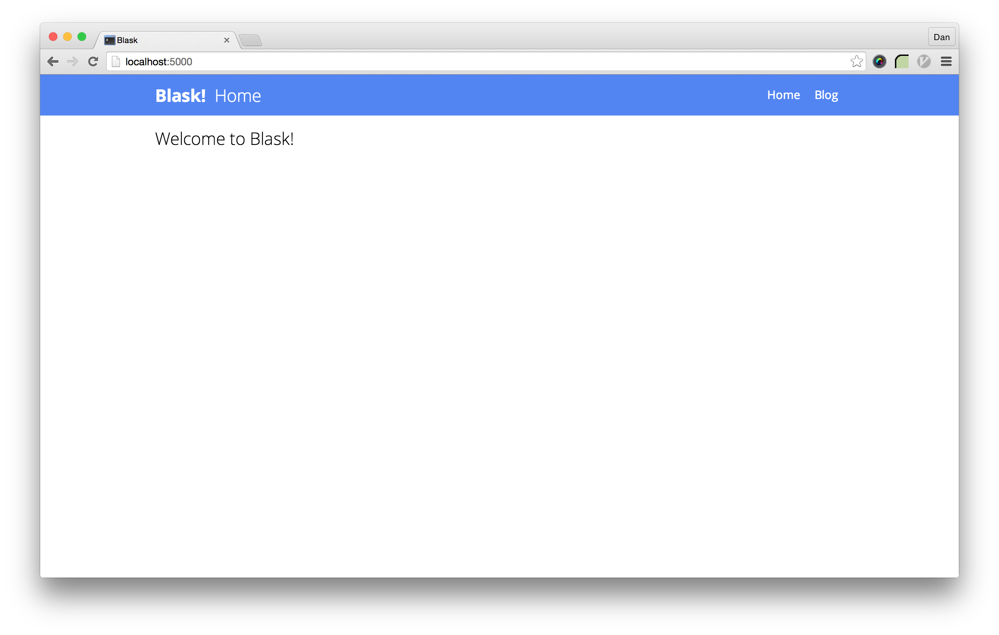
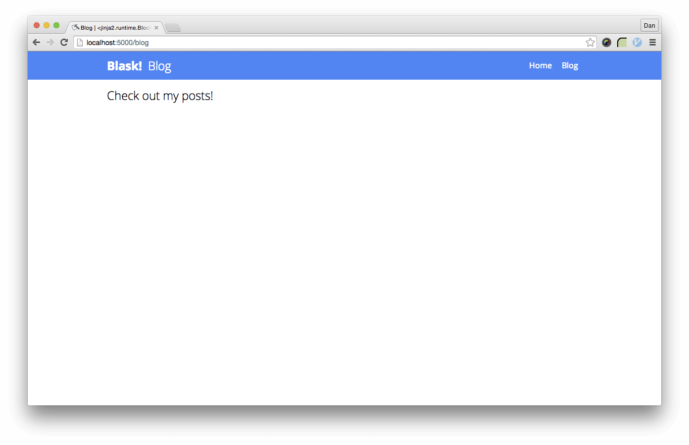

Intermediate Flask
==================

By [Dan Schlosser](http://danrs.ch) and [ADI](https://adicu.com)

## 1.0 Recap: Basic Flask

In case you need a refresh, here's a lighning-speed introduction to Flask

### 1.1 Directory Strucutre

In a basic flask app, This is our directory structure.

```bash
├── app.py          # Application logic
├── static/         # Static content
│   ├── css/        # CSS stylesheets
│   ├── img/        # Images
│   └── js/         # JavaScript files      
└── templates/      # HTML pages
```

All of our Python code lives in `app.py`, and to run the program we run `python app.py`. Static content lives in the `static` folder, and all HTML pages live in the `templates` folder.

### 1.2 Routing

For our sample blog in Flask, or "Blask" as we'll call it, the `app.py` file is fairly simple. 

```python
from flask import Flask, render_template

app = Flask(__name__)

app.config['DEBUG'] = True

@app.route('/')
def home_page():
    """The home page."""
    return render_template('home.html')

@app.route('/blog')
def blog_page():
    """The blog page."""
    return render_template('blog.html')

if __name__ == '__main__':
    app.run(host='0.0.0.0', port=5000)
```

The `@app.route()` decorator creates a *route* in Flask.  A URL endpoint can be accessed at [`http://localhost:5000`](http://localhost:5000).  So in Blask, the url [`http://localhost:5000/`](http://localhost:5000/) will show the contents of `home.html` and [`http://localhost:5000/blog`](http://localhost:5000/blog) will show the contents of `blog.html`.

### 1.3 Templating and `url_for`

In our main template, `home.html`, we define three important [Jinja blocks][jinja-blocks]:

- `` defines the title of the webpage.  We should change this for each other page.
- `` is the name of the current page, and is displayed next to the main website header, `Blask!`.
- `` defines the rest of the page. In order to keep the navbar the same across pages, we leave the `<nav>` element outside the content block.  This block will change page to page.

```html
<html>
<head>
  <title>Blask!</title>
  <link rel='stylesheet' 
      type='text/css'
      href='http://fonts.googleapis.com/css?family=Open+Sans:400italic,700,300,400'>
  <link rel="stylesheet" 
      type="text/css" 
      href="{{ url_for('static', filename='css/style.css') }}">
</head>
<body>
  <nav>
    <div class="content">
      <h1><a href="/">Blask!</a></h1>
      <h2>Home</h2>
      <ul class="menu">
        <li>
          <a href="{{ url_for('home_page') }}">Home</a>
        </li>
        <li>
          <a href="{{ url_for('blog_page') }}">Blog</a>
        </li>
      </ul>
    </div>
  </nav>

  <div class="content">
    
    <h2>Welcome to Blask!</h2>
    
  </div>

  <script src="{{ url_for('static', filename='js/script.js') }}"></script>
</body>
</html>

```

Here's what the home page of Blask looks like.  There's some CSS that will be applied to the project, but we won't dive into it too much.



In the `<link href="">`, `<a href="">`, and `<script src="">` tags, the `url_for` function is used, in double braces.

If you pass the string `static` and a filename in the `static/` folder, it will return the URL path to that asset.  If you pass the name of a route function (here, the ones from `app.py`), it returns the URL for that route.

Using `url_for` allows us to not worry about changing around URLs in our Python code, because the templates will always refer to the same function names.

The `blog.html` file is slightly more interesting:

```html

Blog | {{ super }}
Blog


<h2>Check out my posts!</h2>

```

It *extends* from `home.html`, which means it is identical to `home.html`, except any Jinja blocks defined in `blog.html` will be substituted in.  So here, our blog page will have a different `title`, `current_page`, and `content`.  



## 2.0 Larger Apps in Flask: Using Blueprints

### 2.1 A New Directory Structure

Our traditional app structure places all of our Flask routes in a file called `app.py` in the root folder.  This is fine for smaller applications, but as our app grows we'll want to break this up into multiple files. Moreover, we'll want to include unit tests, configuration, data files, documentation, scripts, and more in our application as it grows.  To accomplish this, we'll develop a directory structure in which the web app is only one component.

Here's what we'll be moving to:

```bash
├── app/                # Anything connected to the webapp
│   ├── __init__.py     # Core application logic
│   ├── routes/         # Routing
│   │   └── __init__.py # Empty file
│   ├── static/         # Static content
│   │   ├── css/        # CSS stylesheets
│   │   ├── img/        # Images
│   │   └── js/         # JavaScript files
│   └── templates/      # HTML pages
└── run.py              # The boot script
```

The `app` folder holds the entire web application.  Next to it in the same directory is where we will put tests, auxiliary scripts, and configuration files. Inside it, `__init__.py` takes the role of what `app.py` did before.  It creates an instance of the `Flask` class, etc:

```python
from flask import Flask

app = Flask(__name__)
app.config['DEBUG'] = True
# ...
```

The `static` and `templates` folders perform similar functions as they did before.  On the other hand, routes will be moved out of `app.py` and into their own files within the `routes` folder.  Every file in here will be represent a Blueprint, but we're getting ahead of ourselves (that's coming up next).  For reasons that will be explained in the next section, we also need a file called `__init__.py` in the `routes` folder.

The last file to look at is `run.py`. It's pretty short:

```python
from app import app

if __name__ == '__main__':
  app.run(host='0.0.0.0', port=5000)
```

What it does is import the `Flask` instance called `app` from `app/__init__.py`, and call `app.run()` on it once the script is executed.  This is pretty confusing, so lets look into how this works, and then why.

#### 2.1.1 Python Package Management

In python, we can use import syntax like `import <x>` or `from <x> import <y>` on our local directory structure to access variables from multiple files.

In Python, a `module` is a file that contains methods, and a `package` is a folder full of modules, including one called `__init__.py`. Recognize that filename?  When we used  `app/__init__.py` as the filename for our core application logic, we did it for a reason.  In our new directory structure, `app` is a python package.  Same is true for `app/routes/__init__.py`.  The `__init__.py` file can contain logic, or can be empty.

When we write `from app import <x>`, `<x>` can be either:

- Any `.py` file in the `app` folder, or
- Any root-scope variable in `app/__init__.py`.  

So in `run.py`, when we write

```python
from app import app
```

We are importing the Flask instance, `app`, from the `__init__.py` file in the `app` package.

#### 2.1.2 Why Include `run.py`?

We could just as easily put the contents of `run.py` into `app/__init__.py`, and then start the server by doing:

```bash
$ cd app
$ python __init__.py
 * Running on http://0.0.0.0:5000/
 * Restarting with reloader
```

So why not?  Because of how the python package management system works, we need the python file that we execute using `python <file.py>` to be in the same directory as (or in a parent directory of) any modules or packages that we want to import from.  For example, if we wanted to import variables from `app/folder/myvariables.py` in our route `app/routes/blog.py`, we need our original executable python file in the same directory as the `app/` folder. 

Now, in `app/routes/blog.py` we can do

```python
from app.folder.variables import important_variable
```

By running our app from `run.py`, we allow any python file in any directory import from any other file.  This will become very useful, especially as we start adding more complex directory structures.

### 2.2 Blueprints

To allow splitting up of our routes into multiple files, we can take advantage of a powerful feature in Flask called [Blueprints][blueprints].  A Blueprints, practically, are a way to modularize routes.  It allows routes to be defined, referenced, and written in groups.  Here's how it works:  First, create a Blueprint object, in `app/routes/home.py`:

```python
from flask import Blueprint

home = Blueprint('name', __name__)
```

Then, define routes, using the `route()` decorator on the Blueprint, rather than on our Flask object (`app`):

```python
from flask import Blueprint, render_template

home = Blueprint('name', __name__)

@home.route('/')
def home_page():
    """The home page."""
    return render_template('home.html')
```

Finally, we "register" the blueprints to our Flask object (`app`) in `app/__init__.py`, effectively connecting the blueprint to the rest of the app.  To do this, we import the Blueprint objects, then call `app.registerBlueprint()` on them.

```python
from flask import Flask

app = Flask(__name__)

app.config['DEBUG'] = True

# Import and register the Blueprints
from app.routes.home import home
app.register_blueprint(home)
```

We can easily add more Blueprints by adding more files into the `routes` folder, and importing / registering.  Take `app/routes/blog.py`.  Here, we register the Blueprint with a `url_prefix`, which will be prepended to the URLs for any routes defined on the blueprint.

```python
from flask import Blueprint, render_template

# Create the blog Blueprint.  Note that all routes on the blog blueprint have
# '/blog' prepended to them.
blog = Blueprint('blog', __name__, url_prefix='/blog')

@blog.route('/')  # Accessible at /blog/
def blog_page():
    """The blog page."""
    return render_template('blog.html')
```

Then just update `app/__init__.py` and we're done!

```python
from flask import Flask

app = Flask(__name__)

app.config['DEBUG'] = True

# Import and register the Blueprints
from app.routes.blog import blog
from app.routes.home import home
app.register_blueprint(blog)
app.register_blueprint(home)
```

### 2.3 `url_for` Returns

If you try to run our app in its current state, you'll get a `werkzeug.routing.BuildError: ('home_page', {}, None)`.  

Because our routes are now spread across multiple modules, we need to use the Blueprint name to specify which module the desired route lives in.  The string inside a call to `url_for` is `blueprint_name.function_name`.  We can very easily update `home.html` to reflect this:

```html
...
<ul class="menu">
  <li>
    <a href="{{ url_for('home.home_page') }}">Home</a>
  </li>
  <li>
    <a href="{{ url_for('blog.blog_page') }}">Blog</a>
  </li>
</ul>
...
```

And now our app should run! You shouldn't notice any changes in what the app looks like, but under the hood we are now ready to quickly expand to a larger application!


[jinja-blocks]: http://jinja.pocoo.org/docs/dev/templates/#template-inheritance
[blueprints]: http://flask.pocoo.org/docs/0.10/blueprints/